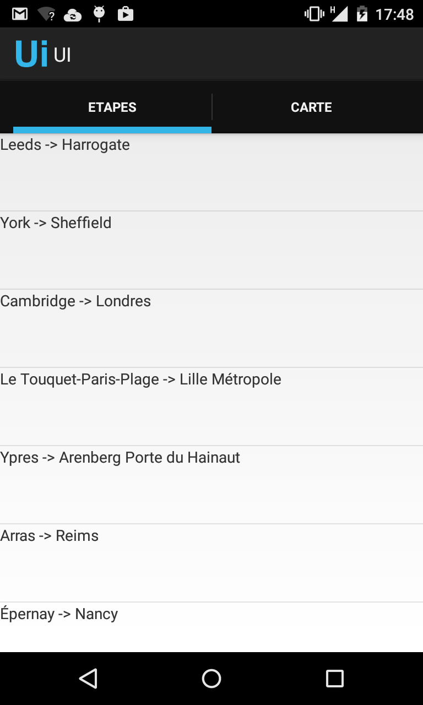
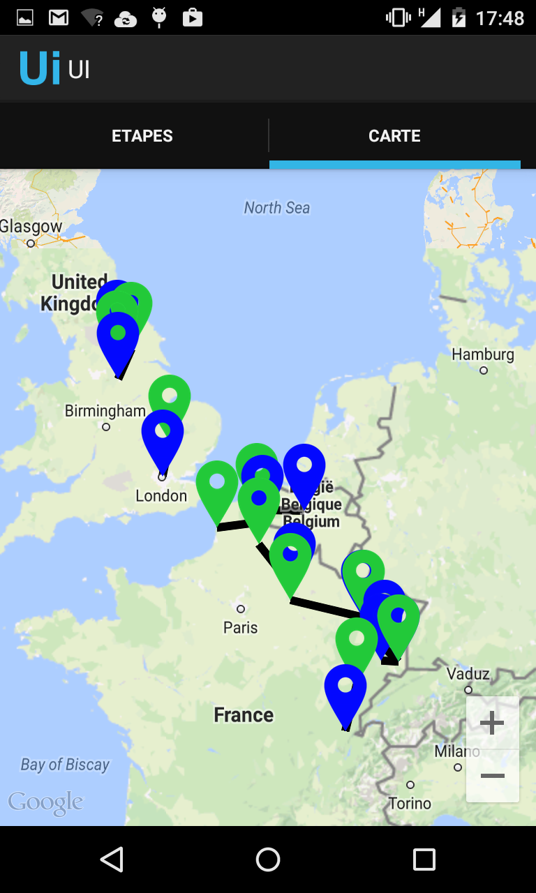
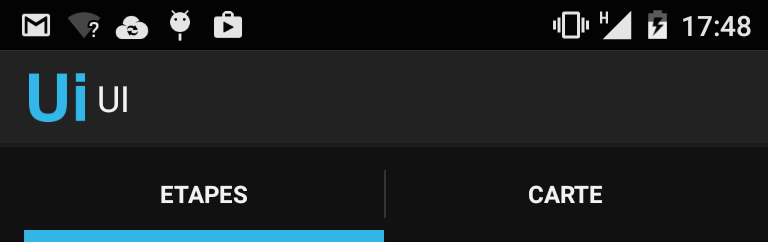
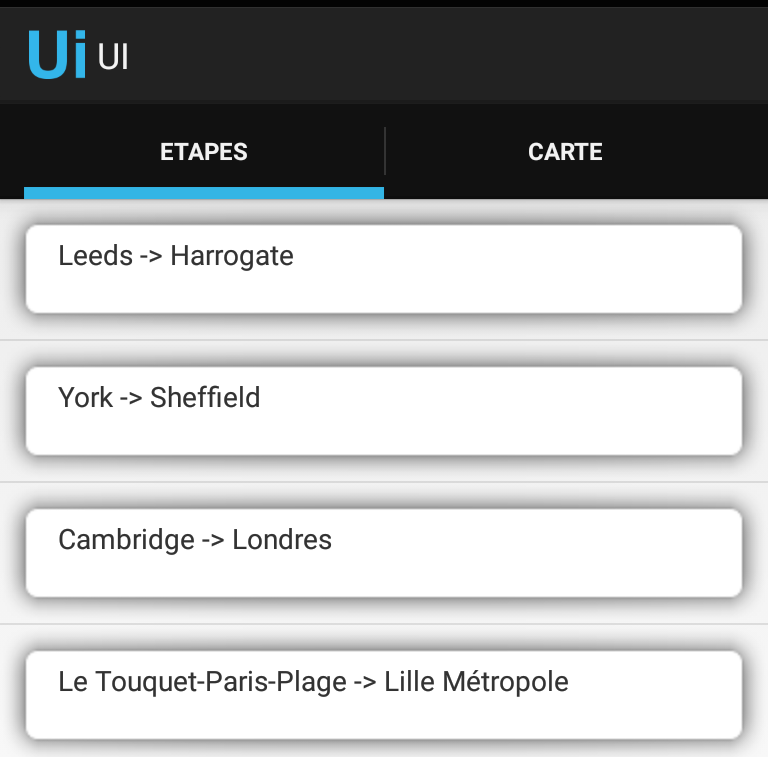
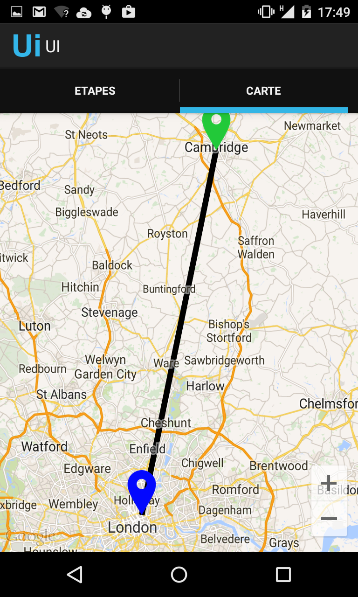

#TP UI

##Contexte

Nous allons réutiliser l'application créée au TP précédent (cartes) et y ajouter une navigation avec onglets (fragments).

##Initialisation

1. Depuis Eclipse, copier ou reprenez le projet précédent

##Préparation de l'Activity principale
- Dans l'Activity principale
  - rajouter un composant `<android.support.v4.view.ViewPager/>` occupant toute la place disponible à l'écran
  - afficher l'ActionBar du support v7 et activer son mode de navigation par onglets (`setNavigationMode()`)
  - ajouter 2 onglets (objet `Tab`) : l'un nommé "Etapes" pour afficher la liste des étapes du tour, l'autre nommé "Carte" pour afficher la carte

##Préparation des fragments
- Créer deux classes de fragments destinés à l'affichage
  - le premier étend `ListFragment` et doit afficher la liste des étapes du tour
  - le second étend `SupportMapFragment` et doit afficher une carte avec la liste des étapes et leurs tracés.
  -  chaque fragment doit obtenir la liste des étapes depuis son `Bundle`.

##Création de l'Adapter
- Le `ViewPager` présent dans notre layout va servir à l'affichage du contenu des onglets. De la même façon que pour les listes, il faut lui passer un `Adapter. Créer une classe `CustomPagerAdapter` qui étend `FragmentPagerAdapter
- Surcharger et remplir les méthodes `getItem()` et `getCount()` 
- `CustomPagerAdapter` prend en paramètre la liste des étapes à afficher. Et les passe à chaque fragment.

##Mise en commun
- Dans l'Activity principale, passer une instance du `CustomPagerAdapter` au `ViewPager`
- Faire en sorte qu'un clic sur un onglet affiche le bon contenu
- Faire en sorte qu'un swipe sur un contenu sélectionne le bon onglet

##Ninepatch
- Récupérer le fichier <a href="button_background.png">suivant</a>
- Le transformer un ninepatch à l'aide de l'utilitaire draw9patch présent dans le dosier du SDK
- Dans la liste des étapes, ajouter le ninepatch comme fond au `TextView`

##Pour aller plus loin
Un clic sur un élément de la liste affiche automatiquement la carte et zoome sur l'étape sélectionnée avec une animation.

