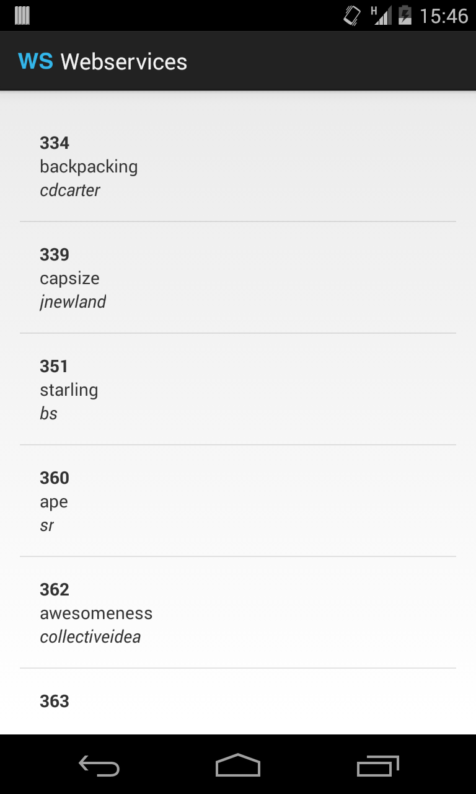

#TP Webservices

##Contexte

Nous allons communiquer avec l'API GitHub pour afficher une liste des "repositories" depuis un ID donné. (https://developer.github.com/v3/repos/).
  - La base_url est https://api.github.com
  - Le endpoint est /repositories
  - Le paramètre GET à utiliser est since

  Dans la capture ci-dessous, nous récupérons la liste des repositories après l'ID 333.



##Initialisation

2. Depuis Eclipse, créer un projet avec une seule activité nommé "Webservices"
3. Créer un écran simple avec une liste
4. Créer un layout de cellule avec 3 TextView
  - un pour l'id
  - un pour le nom
  - un pour l'auteur
5. Créer le POJO Repository suivant. Noter qu'il respecte la structure du JSON retourné par le webservice https://api.github.com/repositories.
	```
	public class Repository {
		public int id;
		public String name;
		public String full_name;
		public Owner owner;
		public String description;
		
		public static class Owner{
			public int id;
			public String login;
		}
	}
	```
6. Créer et implémenter une classe RepositoriesAdapter qui étend BaseAdapter. Elle permet à partir d'une collection de Repository d'afficher les cellules remplies.
  - Utiliser le pattern View Holder

##Appels réseau avec les classes du système

1. Créer une classe étendant `AsyncTask<Void, Void, List<Repository>>`.
  - Utiliser la classe AndroidHttpClient pour votre appel réseau
  - Transformer le flux de retour du webservice avec la bibliothèque GSON (http://mvnrepository.com/artifact/com.google.code.gson/gson/2.3).
  - Ecrire le code pour rafraichir l'UI avec la liste des repositories
  - Tester l'appel réseau. Pourquoi ne fonctionne t'il pas ? Corriger.
2. Répétez l'étape précédente avec une nouvelle AsyncTask utilisant HttpURLConnection.

##Appels réseau avec Retrofit, partie 1 (version naïve)

1. Télécharger le .jar de Retrofit et l'inclure au projet (http://square.github.io/retrofit/).
2. Parcourir la documentation en ligne
3. Créer une interface Retrofit pour l'appel au endpoint `/repository`.
4. Dans l'interface, créer une fonction d'appel synchrone
5. Depuis l'Activity, créer l'implémentation du service.
6. Exécuter l'application. Que se passe t'il ? Pourquoi ?
7. Dans l'interface, créer une fonction d'appel asynchrone
8. Dans l'activity changer l'implémentation pour de l'asynchrone
8. Faire l'appel réseau et rafraichir l'UI avec la liste des repositories

Cette approche peut être améliorée ! Quel est l'inconvénient majeur ?

##Appels réseau avec Retrofit, partie 2 (cycle de vie de l'Application)

1. Créer une classe WebservicesApplication qui étend Application. Attention, il y a une subtilité pour faire marcher l'application !
2. Créer une classe GithubApiManager pour encapsuler l'interface Retrofit
3. Stocker une instance de GithubApiManager dans l'application
4. Depuis l'activity, effectuer récupérer GithubApiManager et effectuer l'appel réseau

Cette approche peut encore être améliorée ! Quel est l'inconvénient majeur ?

##Appels réseau avec Retrofit, partie 3 (bus de données)

1. Récupérer la lib EventBus (http://search.maven.org/#artifactdetails%7Cde.greenrobot%7Ceventbus%7C2.4.0%7Cjar)
2. Créer une classe pour chacun des évènements suivants :
  - demander la liste des Repository
  - renvoyer la liste des Repository
3. Utiliser un bus de données dans l'Application. Il doit servir :
  - au GithubApiManager pour télécharger la liste des Repository à la demande
  - à l'Activity pour demander la liste des Repository
4. N'oubliez pas de vous enregistrer et dé-enregistrer des évènements lorsque cela n'est plus nécessaire

##Pour aller plus loin

